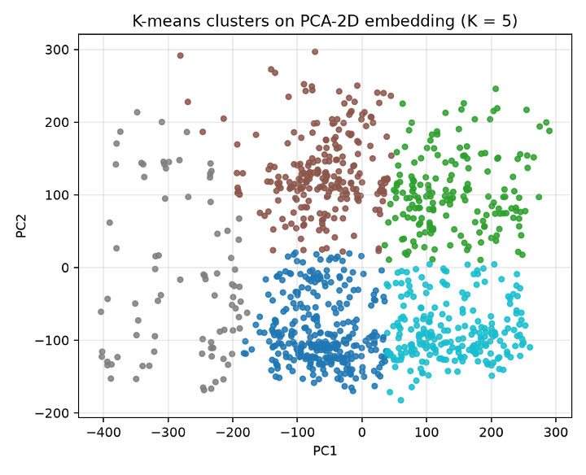
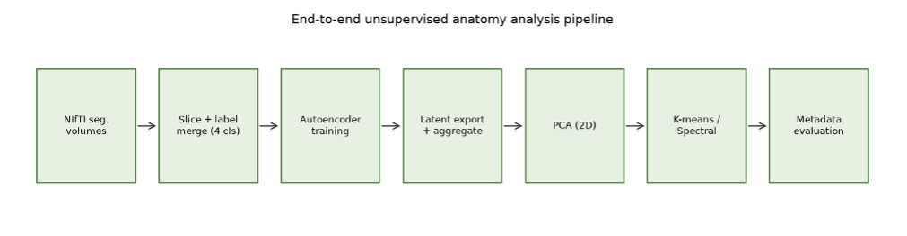
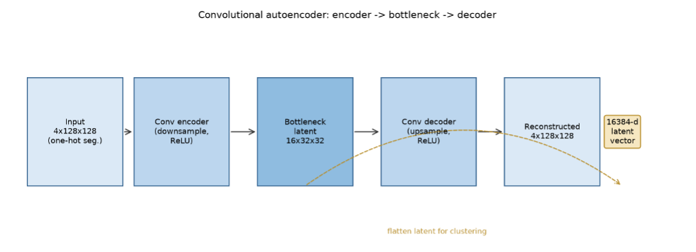
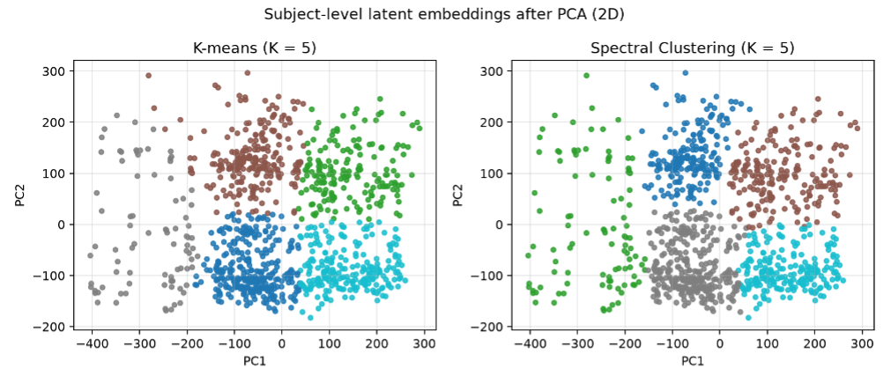
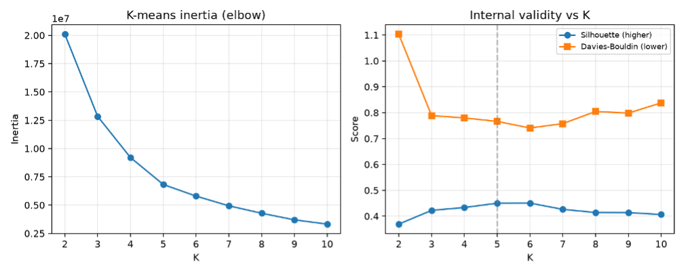

# 🧠 Unsupervised Brain MRI Representation Learning & Clustering

An unsupervised machine learning project exploring anatomical patterns in brain MRI segmentation data using **convolutional autoencoders, PCA, K-means clustering, and Spectral Clustering**.

The project uses brain MRI segmentation data derived from the **OASIS-3 dataset** and investigates whether representations learned by an autoencoder preserve enough anatomical information to support unsupervised grouping of subjects.

<p align="center">
  
</p>

<p align="center">
  <em>Final K-means clustering of the PCA-reduced subject-level latent representation (K = 5).</em>
</p>

---

## 🔬 Project Overview

Structural brain MRI contains information about anatomical variation, ageing, cortical differences, and potential patterns of atrophy.

Instead of manually engineering anatomical features, this project explores an unsupervised deep-learning pipeline that learns compact representations directly from segmented brain anatomy.

### Pipeline

**NIfTI segmentations → Preprocessing → Autoencoder → Latent representations → PCA → Clustering**

<p align="center">
  
</p>

<p align="center">
  <em>End-to-end unsupervised brain MRI analysis pipeline.</em>
</p>

### Research Question

> Can a convolutional autoencoder trained on 2D brain MRI segmentation masks from OASIS-3 learn latent representations that preserve enough anatomical structure to support meaningful unsupervised clustering of subjects?

---

## 📊 Dataset

The analysis uses segmentation data derived from the **OASIS-3 (Open Access Series of Imaging Studies)** dataset.

The reference experiment included:

- **2,660 NIfTI files**
- **1,043 unique subjects**
- T1-weighted MRI-derived segmentation volumes
- 2D slices extracted from the original volumes

The anatomical segmentation labels were reduced to four classes:

1. Background
2. White matter
3. Cortical gray matter
4. Deep / other anatomical structures

> The original OASIS-3 imaging data are not included in this repository.

---

# ⚙️ Methodology

## 1. MRI Preprocessing

The NIfTI segmentation volumes were converted into 2D slices for modelling.

Slices with a very low proportion of foreground anatomy were removed to avoid near-empty inputs.

The original segmentation labels were then merged into four broader anatomical classes.

---

## 2. Convolutional Autoencoder

A convolutional encoder-decoder architecture was used to learn compressed representations of brain anatomy without relying on diagnostic labels.

<p align="center">
  
</p>

<p align="center">
  <em>Convolutional autoencoder used to generate latent anatomical representations.</em>
</p>

### Reference Configuration

| Parameter | Value |
|---|---:|
| Input size | 128 × 128 |
| Input classes | 4 |
| Latent spatial size | 32 × 32 |
| Latent channels | 16 |
| Flattened latent vector | 16,384 |
| Batch size | 16 |
| Learning rate | 1e-3 |
| Training epochs | 10 |
| Focal gamma | 2.0 |

Focal loss was used to reduce the dominance of background pixels and frequently occurring tissue classes.

### Reconstruction Performance

The reference run achieved:

- **Best validation loss:** 0.001872
- **Test loss:** 0.001772
- **Reconstruction mismatch:** approximately 0.15%
- **Mean absolute reconstruction difference:** 0.0023

These results indicate that the latent bottleneck retained substantial anatomical information from the original segmentation masks.

---

## 3. Subject-Level Latent Representations

After evaluation, latent representations were extracted and aggregated at subject level.

The resulting merged feature matrix contained:

```text
1,043 subjects × 16,384 latent features
```

These high-dimensional representations were then used as the basis for dimensionality reduction and clustering.

---

## 4. PCA Dimensionality Reduction

Principal Component Analysis (PCA) was applied to obtain a two-dimensional representation of the latent features.

The first two principal components explained approximately:

- **PC1:** 25.37%
- **PC2:** 16.65%
- **Combined:** 42.02%

Because clustering was performed on this PCA-2D representation, the results describe structure within this projection rather than the complete 16,384-dimensional latent space.

---

## 5. Unsupervised Clustering

Two clustering algorithms were evaluated:

- **K-means**
- **Spectral Clustering**

<p align="center">
  
</p>

<p align="center">
  <em>Comparison of K-means and Spectral Clustering on the PCA-2D latent representation.</em>
</p>

Clustering performance was evaluated using:

- Silhouette Score
- Davies-Bouldin Index
- Calinski-Harabasz Score
- Inertia for K-means

### Final Comparison at K = 5

| Method | Silhouette ↑ | Davies-Bouldin ↓ | Calinski-Harabasz ↑ |
|---|---:|---:|---:|
| **K-means** | **0.4502** | **0.7662** | **1021.14** |
| Spectral Clustering | 0.4405 | 0.8019 | 986.95 |

K-means slightly outperformed Spectral Clustering across the three internal validation metrics in the reference experiment.

This does not imply that K-means is generally superior to Spectral Clustering; rather, centroid-based clustering appeared to be well suited to the PCA representation used in this analysis.

---

# 👩‍💻 My Contribution — K-means Clustering

This was a **collaborative academic research project**.

My individual contribution focused on the **K-means clustering branch of the analysis**.

I was responsible for:

- Implementing and evaluating the K-means clustering workflow
- Designing the cluster sweep from **K = 2 to K = 10**
- Configuring reproducible models using `n_init=20` and `random_state=42`
- Evaluating clustering quality using multiple internal validation metrics
- Analysing the K-means inertia / elbow curve
- Comparing Silhouette, Davies-Bouldin, and Calinski-Harabasz scores
- Selecting the final number of clusters
- Fitting the final K-means model
- Assigning cluster labels to subjects
- Exporting K-means cluster assignments for downstream analysis
- Comparing K-means results with the project's Spectral Clustering results
- Interpreting the resulting cluster structure and limitations

---

## 📈 Selecting the Number of Clusters

I evaluated K-means models for values of:

```text
K = 2, 3, 4, ..., 10
```

For every value of K, four measures were recorded:

- **Inertia**
- **Silhouette Score**
- **Davies-Bouldin Index**
- **Calinski-Harabasz Score**

<p align="center">
  
</p>

<p align="center">
  <em>K-means inertia curve and internal clustering validity metrics across K = 2–10.</em>
</p>

### K-means Evaluation

| K | Inertia | Silhouette | Davies-Bouldin | Calinski-Harabasz |
|---:|---:|---:|---:|---:|
| 2 | 20,091,954 | 0.369 | 1.103 | 703.3 |
| 3 | 12,835,555 | 0.423 | 0.789 | 843.9 |
| 4 | 9,205,370 | 0.434 | 0.780 | 920.3 |
| **5** | **6,822,111** | **0.450** | **0.766** | **1021.1** |
| 6 | 5,795,128 | 0.451 | 0.741 | 997.4 |
| 7 | 4,938,400 | 0.427 | 0.758 | 1004.4 |
| 8 | 4,280,390 | 0.414 | 0.805 | 1015.1 |
| 9 | 3,698,343 | 0.414 | 0.798 | 1047.3 |
| 10 | 3,322,719 | 0.407 | 0.838 | 1048.1 |

The inertia curve showed diminishing improvements around **K = 5**, while the silhouette score reached a plateau around **K = 5–6**.

The Davies-Bouldin score was also near its minimum in this region.

Balancing the different metrics while maintaining an interpretable solution, **K = 5 was selected as the final configuration**.

---

## 🎯 Final K-means Clustering

The final K-means model was fitted using:

```python
KMeans(
    n_clusters=5,
    n_init=20,
    random_state=42
)
```

<p align="center">
  
</p>

<p align="center">
  <em>Final K-means assignment on the PCA-2D latent representation using K = 5.</em>
</p>

### Final Performance

| Metric | Score |
|---|---:|
| Silhouette Score | **0.450** |
| Davies-Bouldin Index | **0.766** |
| Calinski-Harabasz Score | **1021.1** |

The five clusters contained:

| Cluster | Subjects |
|---|---:|
| Cluster 0 | 312 |
| Cluster 1 | 178 |
| Cluster 2 | 236 |
| Cluster 3 | 84 |
| Cluster 4 | 233 |

---

## 📊 Cluster Population Distribution

<p align="center">
  
</p>

<p align="center">
  <em>Population distribution of K-means and Spectral Clustering at K = 5.</em>
</p>

The cluster populations were uneven but non-degenerate.

This indicates that the models identified structure within the PCA representation rather than collapsing most subjects into a single cluster.

---

# 🛠️ Technologies

### Programming & Data Science

- Python
- NumPy
- Pandas
- Jupyter Notebook

### Machine Learning

- PyTorch
- scikit-learn
- Convolutional Autoencoders
- Representation Learning
- K-means Clustering
- Spectral Clustering
- Principal Component Analysis
- Cluster Validation

### Medical Imaging

- Brain MRI
- NIfTI
- Anatomical Segmentation
- OASIS-3

---

# 📁 Main Project Components

### `autoencoder_main.ipynb`

Implements:

- NIfTI data loading
- Segmentation label merging
- Data preprocessing
- Convolutional autoencoder
- Training and evaluation
- Latent feature extraction

### `k-means.ipynb`

Implements:

- Loading merged subject embeddings
- PCA dimensionality reduction
- K-means clustering
- K sweep from 2–10
- Inertia / elbow analysis
- Silhouette analysis
- Davies-Bouldin evaluation
- Calinski-Harabasz evaluation
- Spectral Clustering comparison
- Final cluster assignment

### `assets/`

Contains the figures used in this README:

```text
assets/
├── pipeline.png
├── autoencoder_architecture.png
├── clustering_comparison.png
├── cluster_population.png
├── kmeans_k_selection.png
└── kmeans_final_clusters.png
```

---

# ▶️ Running the Project

Clone the repository:

```bash
git clone YOUR-GITHUB-REPOSITORY-URL
```

Enter the project directory:

```bash
cd YOUR-REPOSITORY-NAME
```

Install the dependencies:

```bash
pip install -r requirements.txt
```

Start Jupyter Notebook:

```bash
jupyter notebook
```

Then open:

```text
autoencoder_main.ipynb
```

or:

```text
k-means.ipynb
```

The OASIS-3 imaging data must be obtained separately and the relevant dataset paths configured before running the complete pipeline.

---

# ⚠️ Limitations

This project is an **exploratory unsupervised analysis** and the resulting clusters should not be interpreted as clinically validated patient subtypes.

Important limitations include:

- Clustering was performed on a **two-dimensional PCA representation**
- PC1 and PC2 together represented approximately **42% of the total latent-space variance**
- A representative **2D slice** was used rather than complete 3D MRI volumes
- Clinical metadata were not used to formally validate the biological meaning of the clusters
- Computational constraints limited systematic architecture and hyperparameter searches
- K-means assumes relatively compact and approximately spherical clusters
- The reported experiment represents a reference configuration rather than a comprehensive hyperparameter search

---

# 🚀 Future Work

Possible extensions include:

- Full **3D MRI analysis**
- Clustering directly within higher-dimensional latent spaces
- Alternative autoencoder architectures
- Systematic hyperparameter optimisation
- Repeated experiments using multiple random seeds
- Additional clustering approaches
- Integration of clinical metadata
- Investigation of cluster relationships with ageing
- Analysis of cortical atrophy patterns
- Investigation of disease progression and cognitive status

---

# 💡 Key Takeaway

This project demonstrates how **deep representation learning and unsupervised clustering can be combined to explore anatomical variation in brain MRI data without using diagnostic labels during model training**.

The convolutional autoencoder produced compact latent representations of segmented brain anatomy, and K-means identified moderately separated subject groups within the PCA-projected latent space.

At **K = 5**, K-means achieved slightly stronger internal clustering metrics than Spectral Clustering in the reference experiment.

---

# 🤝 Project Context & Attribution

This repository contains work from a **collaborative academic project in Deep Learning for Medical Imaging**.

My individual focus was the **K-means clustering analysis**, including:

- cluster-number evaluation,
- internal validation metric selection,
- final model configuration,
- subject-level cluster assignment,
- and interpretation of the resulting partition.

The original collaborative project repository can be found here:

https://github.com/yashar2028/fwp_brain_volume_clustering

---

## 📚 Dataset Reference

LaMontagne, P. J., Benzinger, T. L. S., Morris, J. C., et al. (2019).  
**OASIS-3: Longitudinal neuroimaging, clinical, and cognitive dataset for normal aging and Alzheimer disease.**  
*medRxiv.*

https://doi.org/10.1101/2019.12.13.19014902
